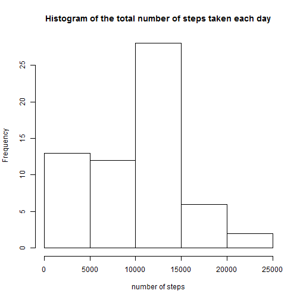
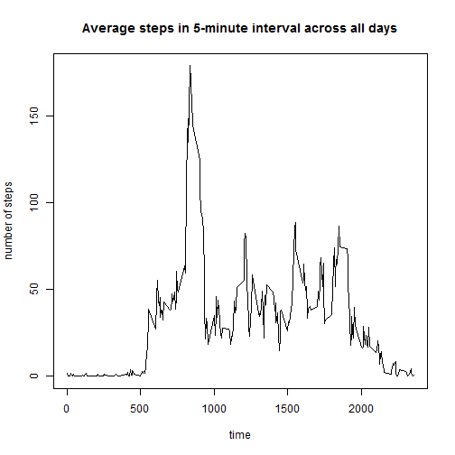
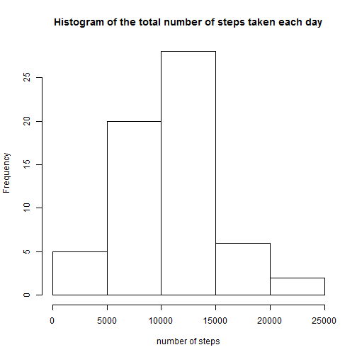

## Loading and preprocessing the data

Loading the data

```r
data <- read.csv("activity.csv")
```

## What is mean total number of steps taken per day?
First, group the number of steps taken by date.

```r
total.steps <- tapply(data$steps, data$date, sum, na.rm = TRUE, simplify = TRUE)
```
Create histogram of the total number of steps taken each day

```r
hist(total.steps, xlab = "number of steps", main = "Histogram of the total number of steps taken each day")
```

 

Calculate the mean and median total number of steps taken per day.

```r
mean <- mean(total.steps)
print(mean)
```

```
## [1] 9354.23
```

```r
median <- median(total.steps)
print(median)
```

```
## [1] 10395
```
The mean and median total number of steps taken per day are 9354.2295082 and 10395

## What is the average daily activity pattern?

Calculate the average number of of steps taken in each 5-minute interval across all days.

```r
data$interval <- as.factor(data$interval)
step_avg <- tapply(data$steps, data$interval, sum, na.rm = TRUE, 
    simplify = TRUE)/length(levels(data$date))
```
Make a plot(time series) of the average number of steps taken.

```r
plot(x = levels(data$interval), y = step_avg, type = "l", xlab = "time", 
    ylab = "number of steps", main = "Average steps in 5-minute interval across all days")
```

 

Finding 5-minute interval containing maximum number of steps on average across all the days.

```r
max(step_avg)
```

```
## [1] 179.1311
```

```r
names(which.max(step_avg))
```

```
## [1] "835"
```

The maximum number of steps on average across all the days is 179.1311475 in the interval number 835.

## Imputing missing values
Calculate the total number of missing values in the dataset.

```r
na_num <- sum(!complete.cases(activity$steps))
```
The total number of missing values in the dataset is 0.

Use the mean/median of a 5-minute interval that has NAs to fill in all of the missing values in that interval. 


```r
data1 <- activity
for (i in 1:length(activity$steps)) {
    if (is.na(activity$steps[i])) {
        for (j in 1:length(step_average)) {
            if (as.character(activity$interval[i]) == names(step_average[j])) 
                activity$steps[i] = step_average[j]
        }
    }
}
data2 <- activity
clean_step_sum <- tapply(data2$steps, data2$date, sum, na.rm = TRUE, 
    simplify = TRUE)
```


```r
hist(clean_step_sum, xlab = "number of steps", main = "Histogram of the total number of steps taken each day")
```

 

## Are there differences in activity patterns between weekdays and weekends?
